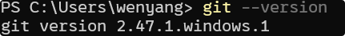
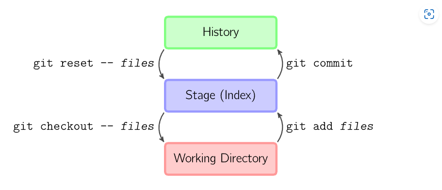
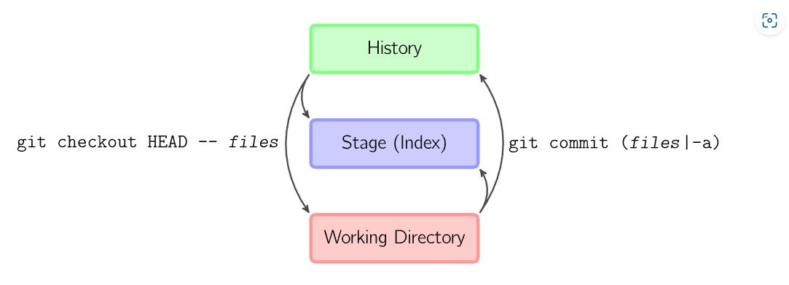
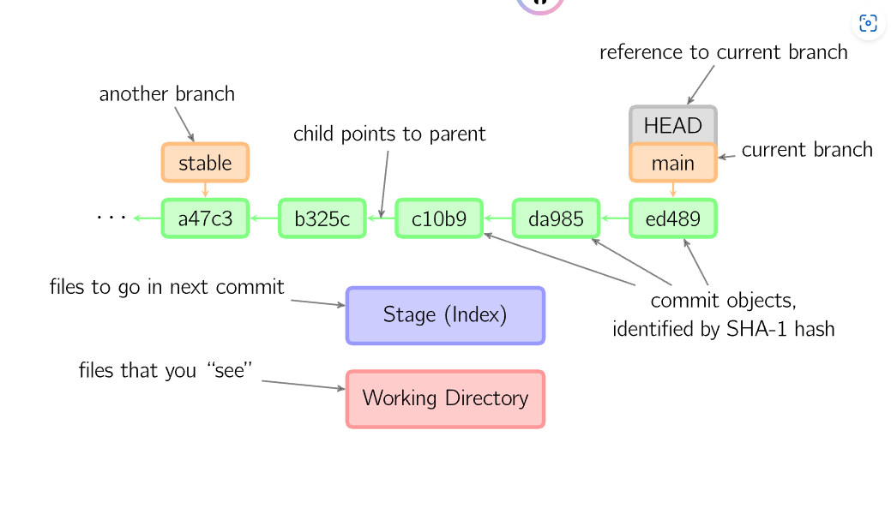
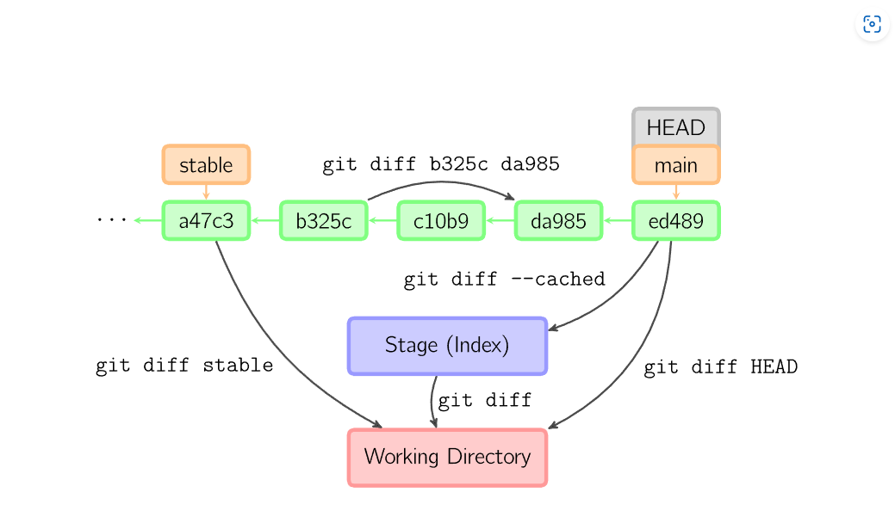
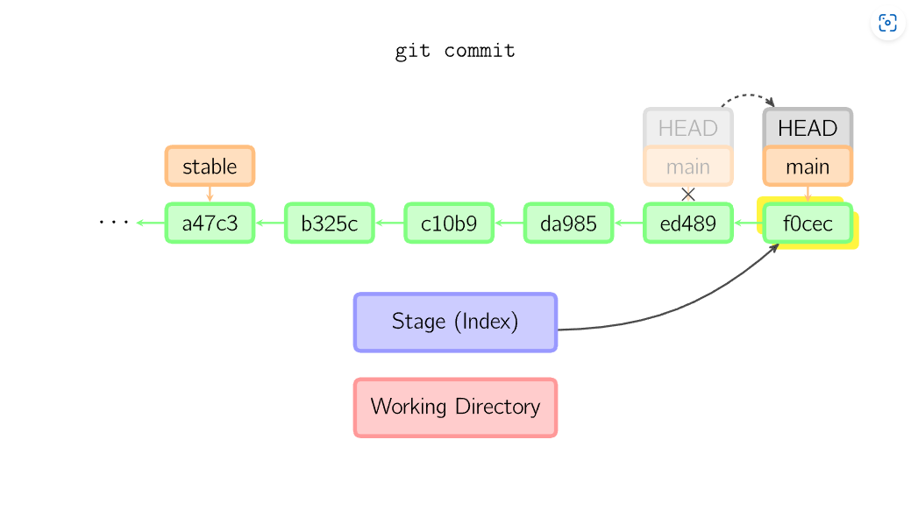
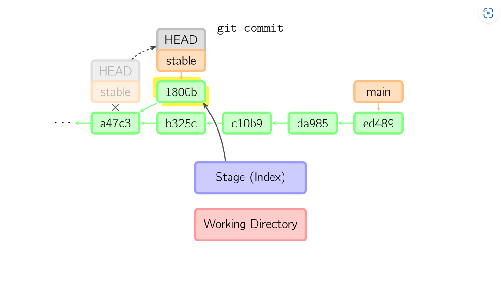
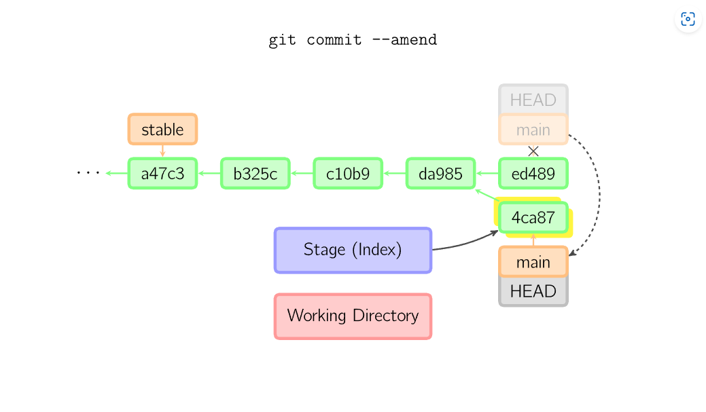
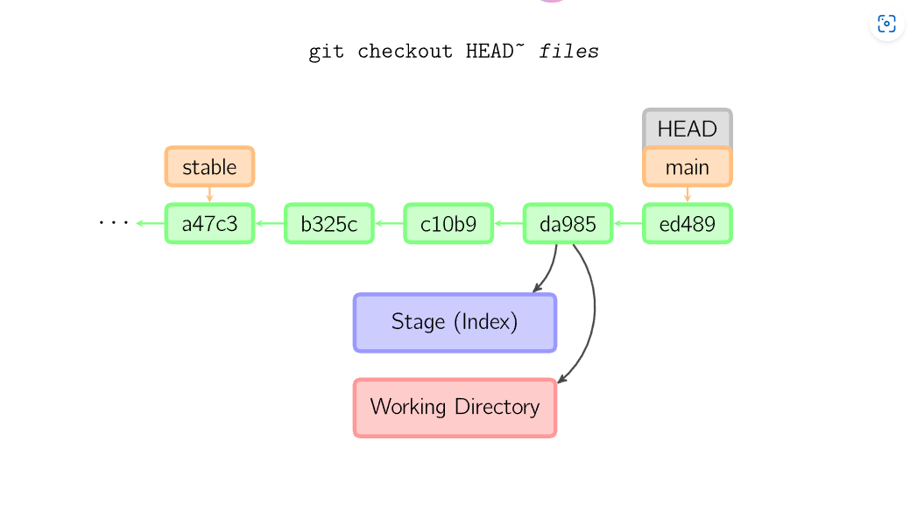
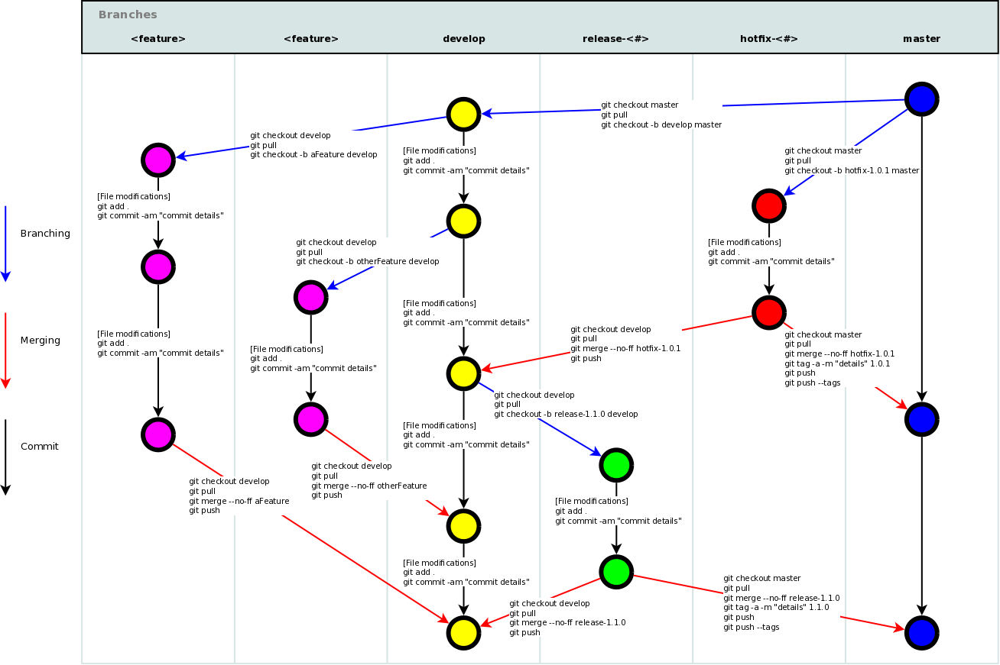

# git使用教程

## 目录

* [git简介](#git简介)

* [git安装与配置](#git安装与配置)

* [git基础操作和使用](#git基础操作和使用)

* [推荐的学习git网站链接](#推荐的学习git网站链接)

## git简介

> Git是一个分布式版本控制系统DVCS，用于高效地管理和跟踪文件的更改。它由Linux内核的创始人Linus Torvalds开发，旨在处理从小型到大型项目的所有内容，具有高效、灵活和强大的特点。


> 源代码管理 SCM 最佳实践：1. 确保使用的是最新的版本 2. 做详细的笔记 3. 提交之前查看更改 4。 使用分支 5. 就工作流程达成一致
* 通过使用git可以对文件进行跟踪，对版本进行控制和管理，同时可以通过软件操作来对软件版本和项目进行跟踪和控制

## git安装和配置

1. git安装
    * 通过直接在官网下载相关的文件来进行安装和使用
    * git官方网站 [git官方网站](https://git-scm.com/)
    * 下载完成之后，一直点击next之后就是可以了，注意要将git添加到环境变量中
    > 环境变量是操作系统用来存储系统范围内的配置信息的一种机制，他们可以影响运行中的进程的行为，环境变量用于配置系统路径，用户信息，系统设置等，环境变量是一个动态命名值，可以影响运行中的进程或者程序中的行为，他们通常是以键值对的形式来出现的。
2. git基础配置
    * 通过安装好git之后，在终端中运行，`git --version`如果显示结果是如下所示的结果就是表示的就是安装的是没有问题的
    * 
    * 之后就是可以进行配置，首先，对于一个文件追踪的功能软件，对文件修改的人的身份是必须要给出的，通过使用
        1. `git config --权限 user.name = "用户名称"`
        2. `git config --权限 user.email = "用户的邮箱"`
    * 对于使用github的用户来说，如果需要使用ssh来进行配置，就是需要来获取私钥，获取私钥的方式就是可以通过使用以下的方式来进行获取
        1. 首先打开终端窗口，然后运行`ssh-keygen -t rsa -b 4096 -C "你的邮箱账号"`，之后直接点击enter键使用默认的位置，通常就是~/.ssh/id_rsa，并选择是否设置密码短语
        2. 生成秘钥对之后，可以通过使用以下命令来查看私钥，`cat ~/.ssh/id_rsa`
        3. 可以通过以下命令来查看私钥`cat ~/.ssh/id_rsa.pub`
    * 之后就是可以通过在github中添加ssh来使用ssh来对仓库来进行操作
    > SSH（Secure Shell）是一种加密网络协议，用于在不安全的网络中安全地操作网络服务。SSH通过使用加密技术来确保数据传输的机密性和完整性，常用于远程登录系统和执行命令。

    ### 使用SSH(同上，但是更加规整)

    1. **生成SSH密钥对**：
        ```sh
        ssh-keygen -t rsa -b 4096 -C "你的邮箱账号"
        ```
        这将生成一个新的SSH密钥对，并提示你输入文件保存位置和密码短语。

    2. **添加SSH密钥到SSH代理**：
        ```sh
        eval "$(ssh-agent -s)"
        ssh-add ~/.ssh/id_rsa
        ```

    3. **将公钥添加到GitHub**：
        - 复制公钥内容：
            ```sh
            cat ~/.ssh/id_rsa.pub
            ```
        - 登录GitHub，进入“Settings” -> “SSH and GPG keys” -> “New SSH key”，粘贴公钥内容并保存。

    4. **测试SSH连接**：
        ```sh
        ssh -T git@github.com
        ```
        如果配置正确，你会看到类似于“Hi username! You've successfully authenticated...”的消息。

    通过以上步骤，你就可以使用SSH来安全地与GitHub仓库进行交互了。

## git基础操作和使用

### git相关的概念：

1. **工作区（Working Directory）**：你在本地看到的文件夹，包含了所有项目文件。

2. **暂存区（Staging Area）**：一个临时存储区域，用于保存即将提交到版本库的更改。

3. **版本库（Repository）**：包含项目的所有版本历史记录的数据库。分为本地版本库和远程版本库。

4. **提交（Commit）**：将暂存区的文件快照永久性存储到版本库的操作。

5. **分支（Branch）**：项目开发的并行版本。默认分支是`main`或`master`。

6. **合并（Merge）**：将不同分支的修改合并到一起。

7. **克隆（Clone）**：从远程版本库复制项目到本地。

8. **拉取（Pull）**：从远程版本库获取最新的更改并合并到本地。

9. **推送（Push）**：将本地提交的更改上传到远程版本库。

10. **冲突（Conflict）**：当不同分支的更改无法自动合并时，需要手动解决冲突。

### git图解操作

* 暂存区(stage) 工作区(working directory) 提交区(history)
* 
* 通过使用`git add 文件名称或者*`可以将特定的文件或者所有的文件都添加到暂存区
* 通过使用`git commit 文件名称或者-a -m "提交的理由"`就是可以将特定的文件或者所有的文件都生成快照并进行提交
* 通过使用`git reset 文件名称`就是可以对特定的文件进行操作，使得最后的结果返回未修改的结果，就是用来撤销最后一次的`git add files`的结果，也可以使用`git reset`撤销所有暂存区域的文件
* 通过使用`git checkout -- files`把文件从暂存区域复制到工作目录，用来丢弃本地的修改
* 
* 也可以直接通过使用 `git commit -a -m "提交的理由"`
* 也可以直接通过使用`git checkout HEAD -- files`来将这一次提交的结果转化到上一次的修改的结果
* 
* 通过上面的图形就是可以知道就是当前的部分就是HEAD部分，所以就是可以通过使用HEAD来代替当前的分支
* 通过上面的图也是可以知道就是当前看到的文件就是working directory，也就是工作区，要通过使用commit命令来实现提交的文件就是处于暂存区。每一个节点都是有一个独有的SHA-1 hash号码
* 
* 通过使用`git diff 一个分支sha 一个分支sha`就是可以查看两个分支节点之间的区别，首先可以通过使用`git log --oneline`来查看简单的序列号
* 
* 通过使用`git commit -a -m "提交理由"`的时候就是会用暂存区的文件来创建一个新的提交，并将此时的节点作为父节点，然后将当前分支指向新的提交节点
* 
* 即使当前分支是某一次提交的祖父节点，git也是会同样进行操作，在上图中在main分支的祖父节点stable分支进行了一次提交，生成了1800b，这样，stable分支就不再是main分支的祖父节点，此时，合并或者衍合是必须的
* 
* 如果想要更改一次提交，可以使用`git commit --amend`git会使用与当前提交相同的父节点来进行新的一次提交，旧的提交就是会被取消
* 
* checkout 命令就是为了从历史提交或者暂存区域中拷贝文件到工作目录，也可以用于切换分支。通过使用这种方式可以来拷贝文件或者切换分支
* 通过使用`git checkout main~3`就是会跳转到当前节点的前三个的节点去，这个main就是一个tag标签名称，其实是没有多大含义的，就是自己标记的，不需要通过使用sha来进行标记
* 通过使用`git checkout -b name`就是可以创建一个新的分支
> 通过以上的例子就是可以知道相关图解的一些内容，之后会进行补充

### git操作全解


[git-cheat-sheet](./git-cheat-sheet.pdf)
* 通过上面的一个git-cheat-sheet和一个图片演示就是可以大体上来了解一些git相关的操作和命令
1. 设置代码仓库
    * 初始化代码仓库 通过使用`git init`来进行使用，通过使用`git init <repo_name>`就是可以为代码仓库来进行设置一个名称
    * 克隆已有的代码仓库，通过使用`git clone <repo_url>`来进行克隆代码仓库，这个repo_url可以使用ssh协议或者https协议都是可以的
    * 在对代码进行修改之后，就是可以使用`git add *或者<file_name>`来将文件提交到暂存区中 也可以使用`git add --all`来讲所有的文件都是提交到暂存区中
    * 之后就是可以通过使用 `git commit -a -m "..."`来对文件进行提交到历史版本，就是上传快照
    * 修改本地的代码仓库之后，如果要将代码仓库来进行提交到远程的代码仓库，就是可以使用 `git remote add <remote_name> <remote_repo_url>`，之后在使用`git push -u <remote_name> <local_branch_name>`来进行处理 remote_name是远程的分支，master是本地的分支,对于使用clone来进行获取的仓库代码是不需要进行使用git remote add这一个步骤的，这是因为在使用git clone这个命令的时候，已经自动配置代码库，并远程指向了这个克隆的代码仓库的git url，所以之后只要使用`git push`可以完成操作的了
    * git config可以对git仓库进行设置相关的配置，比如说名字和邮箱等信息，git将配置选项存储在三个单独的文件中，这可以让你将选项分配到各个代码仓库中(local)，用户(global)，或者整个系统(system)
        1. local 通常是对某一个特定的代码仓库进行设置和配置，/.git/config 就是对于代码仓库的特定的设置
        2. global 通常是对用户的特定的设置，配置文件放在/.gitconfig 这是存储使用--global标记设置选项的地方
        3. 对于一个系统的设置，通常是可以通过使用 --system来进行设置，通过使用这种方式就是可以对系统范围来进行设置，文件存储在$(prefix)/ect/gitconfig
    * 通过设置color.ui就是可以设置Git颜色的主变量，通过使用`git config --global color.ui=false`就是可以设置git终端的彩色输出为禁用的状态
2. 对远程仓库进行克隆
    * 通过使用`git clone`命令来对远程仓库进行克隆，通过使用这种方式就是可以实现将远程仓库的地址克隆到本地的仓库中，并对这个仓库的内容进行修改和修正
    * git克隆的语法`git clone <repo> <directory>`通过使用这个语法就是可以将远程仓库克隆到特定的文件夹中
    * git网址协议
        1. ssh `ssh://[user@]host.xz[:port]/path/to/repo.git/`
        2. git `git://host.xz[:port]/path/to/repo.git/`
        3. http `http[s]://host.xz[:port]/path/to/repo.git/`
3. 通过使用alias来设置git命令的别名
    * 通过使用alias可以设置git命令的别名，比如可以通过使用`git config --global alias.co checkout`，之后就是可以通过使用`git co`来代替`git checkout`
4. 通过使用git add来保留变更 具体语法就是`git add <file> <file> ...`通过使用`git add *`可以将所有的文件都提交到暂存区中
    * 通过使用`git add`可以将变更保留到暂存区中，通过使用`git commit`可以将保留到暂存区的文件进行提交生成快照，通过使用`git reset`可以将提交到暂存区的文件或者已经生成快照的文件进行撤销操作
    * 通过使用`git push`可以将提交的变更提交到远程的存储库进行协同合作
5. 通过使用`git commit`来提交版本快照而不是差异
    * 通过使用`git commit <file> <file> ...`可以对暂存区文件进行提交，生成一个快照
    * 通过使用`git commit -a`可以将所有文件都是提交到快照中去，通过使用`git commit -am "messages"`可以同时添加所有文件和添加的理由
6.  通过使用`git diff <快照名或者sha> <快照名或者sha`就是可以查看两个快照之间的区别，通过使用`git diff --color-words`可以将变更的内容进行显示
    * 也可以用来比较特定的文件，通过在最后添加特定的文件名称就是可以来进行比较
    * 通过使用`git log --pretty=onelien`可以将提交的历史用一句话来进行表示
7.  通过使用`git stash`可以暂时搁置你对工作副本所做处的变更，就是暂存功能
    * 通过使用`git stash`就是可以将最近一次的一个修改进行暂存
    * 通过使用`git stash pop`可以将最近的一次暂存进行恢复并删除保存的修改    
8.  通过使用.gitignore可以将一些文件进行忽略，之后再上传的时候就是可以对文件进行忽略，通过使用这种方式可以将一些不必要的文件给删除
    * 使用.gitignore的时候就是需要新建一个.gitignore文件，然后再这个文件之中来添加一些需要忽略的文件，文件的具体编写的方式可以查看.gitignore文件 [.gitignore文件](./.gitignore)
9.  通过使用`git status`和`git log`来查存储库的状况
    * 通过使用`git status`可以查看代码仓库的当前的状况，可以累出那些文件使已经暂存的staged，未追踪untracked，未暂存unstaged 通过使用`git tag`可以为git历史记录打上标签，通常是用来捕获标记版本发布的历史记录点也就是v1.01之类的，具体的语法就是`git tag <tagname>` 通过使用`git tag`可以显示出来所有的tag名称，通过使用`git tag -d <tag_name>`可以删除相应的tag名称
    * 通过使用`git blame <file_name>`就是可以显示附加到文件中特定提交者的作者的元数据
10. 通过使用`git log`来查看提交的历史记录
    * 通过使用后续的命令就是可以来实现历史记录的格式化
    * 通过使用一些后缀就是可以对文件进行格式化操作`git log --graph --decorate --oneline`
11. 撤销更改 可以通过使用`git clean` `git revert` `git reset` `git rm`
    * `git clean`在某种程度上就是一个撤销命令，`git clean`可以看做是`git reset`和`git checkout`等其他命令的补充，其他命令对先前添加到git追踪的文件进行操作，而`git clean`则是对未追踪的文件进行操作，未追踪的文件实在代码存储库的工作目录中创建但是尚未使用`git add`命令添加到存储库跟踪索引的文件
    * 在实际操的时候，通过使用`git clean -f`来强制将未追踪的文件进行删除，然后进行处理
    * 通过使用`git clean -di`就是可以进入交互式的操作界面来进行操作
12. 
